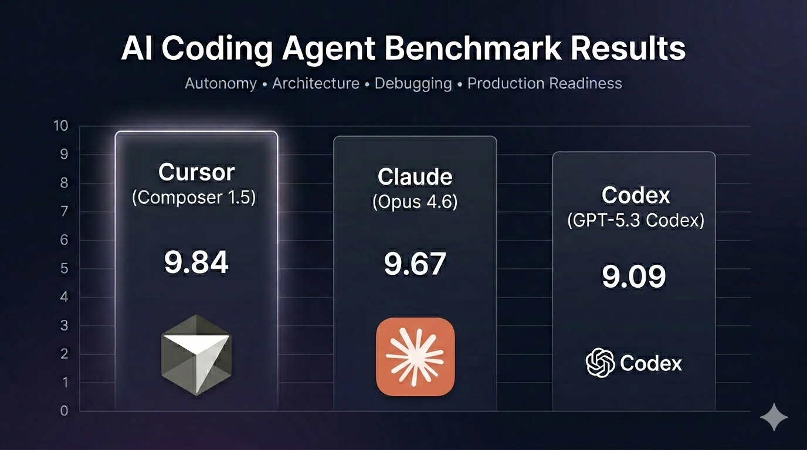

# AI Coding Agent Benchmark



## What Is This?

This repository is a practical benchmark comparing the top coding agents:

- **Cursor**
- **Claude**
- **Codex**

The goal was simple:

> As a full-stack developer, which AI coding agent gives me the most real engineering value?

Online opinions are inconsistent. Rankings are mostly based on subjective experience. So instead of reading opinions, I tested them.

## The Goal

I wanted to measure:

- **Architectural thinking**
- **Autonomy**
- **Debugging capability**
- **Production readiness**
- **How much correction I had to do manually**

Not which AI writes prettier code — but which one actually reduces my workload.

## The Test Project

I intentionally avoided generic projects like a basic webshop.

**Why?**

Because AIs have seen thousands of webshop examples. That creates fake performance — they pattern-match instead of reasoning.

So I designed a more complex, less template-friendly project:

**A multi-tenant SaaS task management system** with authentication, organizations, role-based authorization, lifecycle rules, and Dockerized deployment.

This forced real architectural thinking.

## Methodology

Each AI received the same high-level idea description.

### Step 1 — Planning 📋

I asked each AI to generate a development plan. This project is too large for a single prompt — so planning quality mattered.

### Step 2 — "Eat What You Cooked" Implementation 🍲

Each AI had to implement its own plan. No plan switching. No corrections before execution.

If the plan was weak, implementation suffered.

### Step 3 — Code Quality Review ✨

After completion, I asked the AI to:

- Review its own code
- Improve quality
- Refactor where needed
- Fix inconsistencies

### Step 4 — Surprise Dockerization 🐳

Without warning, I asked each AI to Dockerize the project.

This tested:

- Real production thinking
- Dependency awareness
- Environment handling

### Step 5 — Manual Testing & Debugging 🐛

I:

- Ran the project
- Reviewed the code
- Identified anomalies
- Reported issues back to the AI

The AI had to fix real runtime and logic problems.

## Evaluation

Scores were calculated based on actual performance during:

- Planning quality
- Architecture soundness
- Autonomy
- Security & authorization correctness
- Code quality
- Debugging ability
- Docker readiness
- TypeScript discipline
- Use of existing solutions vs reinventing

Weighted scoring emphasized:

- Idea match
- Autonomy
- Architecture
- Security

## Results

| Model           | Final Score | Summary                                      |
| --------------- | ----------- | -------------------------------------------- |
| Cursor          | 9.84        | Strongest autonomy, best architecture consistency |
| Claude          | 9.67        | Excellent reasoning, slightly more structural gaps |
| Codex (VSCode)  | 9.09        | Good debugging, more implementation errors  |
| Codex (Cursor)  | 8.97        | Solid but required more corrections          |

## Repository Structure

```
/prompts
    first.txt               # Initial idea / planning prompt
    evaluation.txt          # Evaluation criteria & template
    final-debug.txt         # Debugging-phase prompt
    final-dockerization.txt # Dockerization-phase prompt

/cursor
    /code                       # Generated Next.js app
    evaluation.txt              # Evaluation notes & final score
    implementation step logs/   # Plan + implementation logs (0–12, etc.)
    production fix logs/        # Debug session logs (debug-1.txt, …)

/claude
    /code
        /taskflow         # Generated app (nested)
    evaluation.txt
    implementation step logs/
    production fix logs/

/codex-cursor             # Codex run inside Cursor
    /code
    evaluation.txt
    implementation step logs/
    production fix logs/

/codex-vscode             # Codex run inside VSCode
    /code
    evaluation.txt
    implementation step logs/
    production fix logs/
```

### /prompts

Contains all standardized prompts used during testing (planning, implementation, debugging, dockerization, and evaluation).

### /cursor, /claude, /codex-cursor, /codex-vscode

Each model folder contains:

- **code/** — The full generated application (multi-tenant task management app).
- **evaluation.txt** — Evaluation notes, criteria scores, and final summary.
- **implementation step logs/** — Logs from the planning and implementation steps (e.g. `0-plan-generation.txt`, `1.txt` … through final dockerization).
- **production fix logs/** — Logs from the debugging phase (e.g. `debug-1.txt`, `debug-2.txt`, …).

Everything is transparent.

## Key Insight

All models can debug when explicitly guided.

The real difference is:

- **Who anticipates problems?**
- **Who requires fewer corrections?**
- **Who produces production-ready structure without supervision?**

Small architectural mistakes compound. **Autonomy determines leverage.**

## Why This Exists

This repository exists to:

- Replace opinion with measurable comparison
- Show real AI development performance
- Help developers choose tools based on output, not hype

If you want to extend this benchmark, reuse the same prompt structure and evaluation system to keep comparisons fair.
